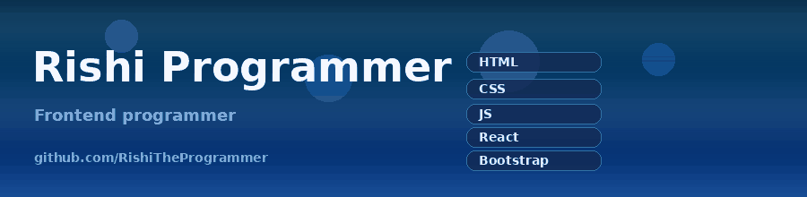
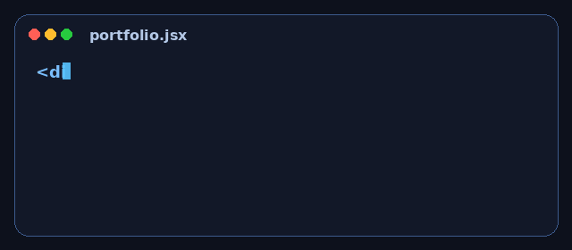

---

## About me

I am a frontend programmer who creates beautiful frontend designs with **Bootstrap**, **React Icons**, **React**, **GSAP** and **CSS animations**.

I like interfaces that feel finished: clear layout, responsive grids, and motion that helps the page instead of getting in the way. I keep learning, then I go back and make older projects better.

- Building with **React**, **Vite**, **GSAP**, **AOS**, and **Typed.js**
- Comfortable with **HTML**, **CSS**, **JavaScript**, and **Git**
- Currently sharpening scroll animation and dashboard UI
- Ask me about Bootstrap layouts, CSS motion, and React component structure

## Toolbox

| Area | What I use | Level |
| --- | --- | --- |
| Structure | HTML5 | Advanced |
| Style and motion | CSS3, Bootstrap, AOS | Advanced / Intermediate |
| Logic | JavaScript | Intermediate |
| UI | React, React Bootstrap, Vite | Intermediate |
| Animation | GSAP, Typed.js | Learning / Intermediate |
| Tools | Git, GitHub, VS Code | Advanced / Intermediate |

## Projects

<table>
  <tr>
    <td width="50%">
      <h3 align="center">Portfolio</h3>
      

        Personal site built with HTML, CSS, JavaScript, React, React Bootstrap, Bootstrap, GSAP, and icon sets.
      

      

        <a href="https://rishitheprogrammer.vercel.app">Live site</a>
        ·
        <a href="https://github.com/RishiTheProgrammer/Portfolio">Source</a>
      

    </td>
    <td width="50%">
      <h3 align="center">Admin Dashboard</h3>
      

        React admin dashboard using GSAP and react-scroll for a cleaner, more modern layout.
      

      

        <a href="https://github.com/RishiTheProgrammer/Admin-Dashboard">Source</a>
      

    </td>
  </tr>
</table>

## GitHub stats

 

## Contribution snake

This animation is generated from the real contribution graph. It shows up after the included GitHub Action runs once.

<picture>
  <source media="(prefers-color-scheme: dark)" srcset="https://raw.githubusercontent.com/RishiTheProgrammer/RishiTheProgrammer/output/github-snake-dark.svg"/>
  <source media="(prefers-color-scheme: light)" srcset="https://raw.githubusercontent.com/RishiTheProgrammer/RishiTheProgrammer/output/github-snake.svg"/>
  
</picture>

**Open to frontend practice, UI polish, and small collaborations.**

